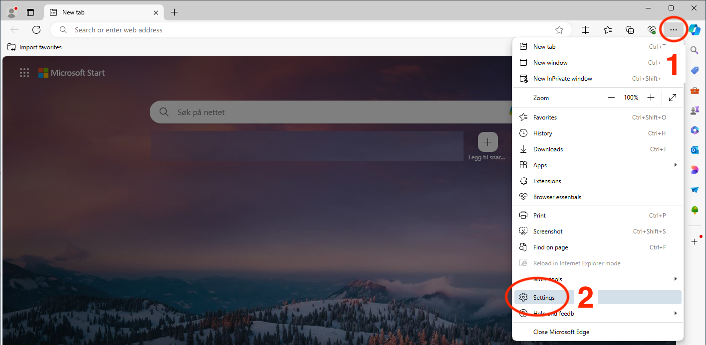
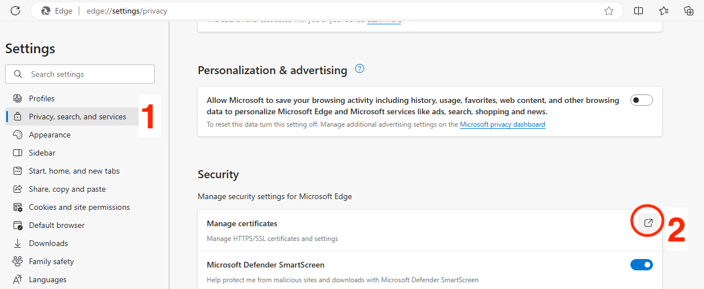
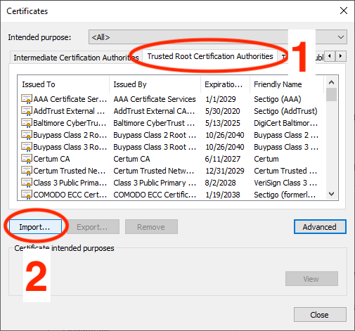
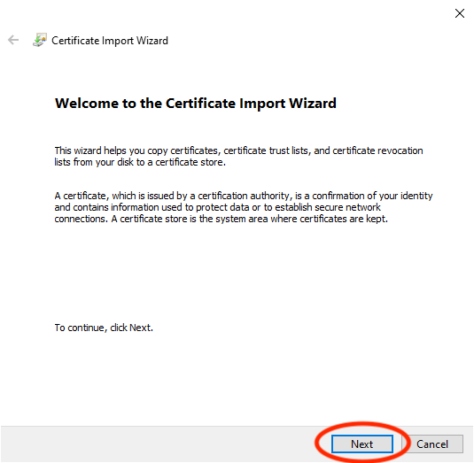
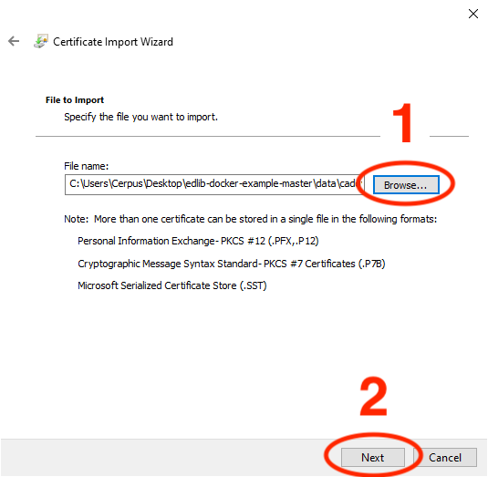
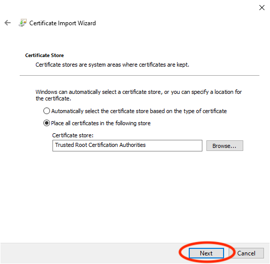
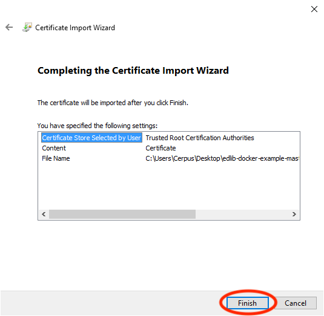
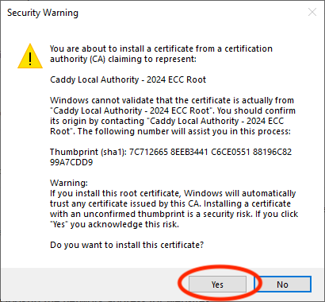
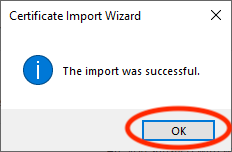
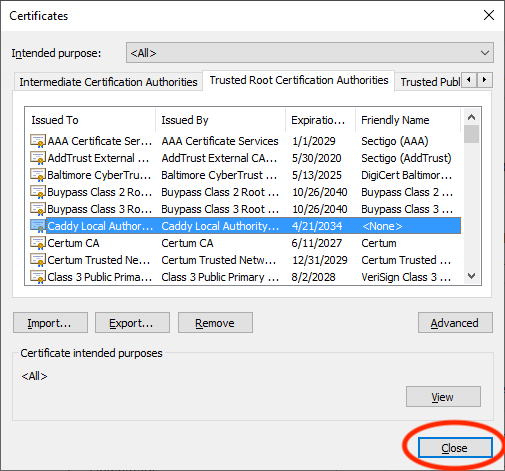

# Installing self-signed root certificates on Windows

1. Open Edge. Go to **Settings**.

   

2. Click **Privacy, search, and services** in the left-hand pane, then scroll
   down to Security, and choose **Manage certificates**.

   

3. Select the **Trusted Root Certification Authorities** tab, then hit
   **Import**.

   

4. Click **Next** after being greeted by the wizard.

   

5. Hit **Browse**, pick the `root.crt` file in
   `data/caddy/data/caddy/pki/authorities/local`. Click **Next**.

   

6. Do not change any setting on the Certificate Store step. Click
   **Next**.

   

7. Thank the wizard and click **Next**.

   

8. A security warning will pop up, asking if you're really sure you
   want to do the thing you just did. Hit **Yes**.

   

9. A dialogue pops up, telling you the import was successful. Click
   **OK**.

   

10. Verify the "Caddy Local Authority" certificate is in the list.

   

11. Restart Edge or any other web browser you have running. Navigating to
    <https://hub.localhost> should now work.
